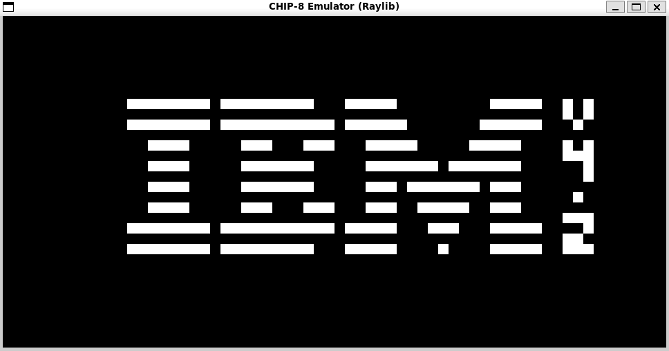

# C-CHIP8 Emulator

Ein leichtgewichtiger **CHIP-8 Emulator**, geschrieben in C unter Verwendung der **Raylib** Grafikbibliothek.



## Features
* **Vollständiger Befehlssatz:** Alle 34 originalen CHIP-8 Opcodes sind implementiert.
* **Grafik:** Gerendert mit Raylib (skaliert auf moderne Auflösungen).
* **Input:** Unterstützung für das originale 16-Tasten-Hex-Keypad.
* **Plattform:** Optimiert für Linux/WSL.

## Voraussetzungen (WSL/Ubuntu)
Bevor du das Projekt baust, musst du Raylib und die Grafik-Abhängigkeiten installieren:

```bash
sudo apt update
sudo apt install libraylib-dev build-essential cmake
```

## Tests & Credits
Um die Genauigkeit der CPU-Implementierung sicherzustellen, wurde dieser Emulator mit der **[Timendus CHIP-8 Test Suite](https://github.com/Timendus/chip8-test-suite)** verifiziert.